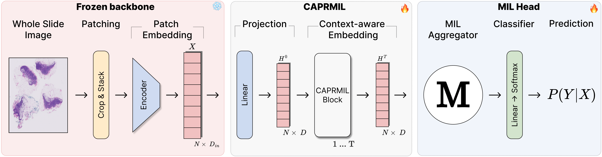
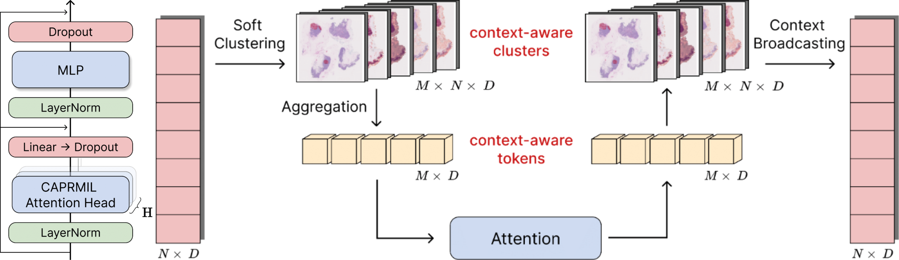

# **CAPRMIL**: Context-Aware Patch Representations for Multiple Instance Learning

This repository contains the official implementation and supporting materials for **CAPRMIL**, as introduced in our paper:

**CAPRMIL: Context-Aware Patch Representations for Multiple Instance Learning**  
*Under review – MIDL 2026*



**Figure:** Overall CAPRMIL architecture. Whole Slide Images are tessellated into patches and encoded using a frozen backbone. After a linear projection, a stack of CAPRMIL Blocks injects global context into patch embeddings. A MIL aggregator and classifier then produce the slide-level prediction.

## CAPRMIL Attention Mechanism



**Figure:** CAPRMIL Attention head. Patch embeddings are softly assigned to a small number of context-aware clusters, aggregated into global tokens, processed via multi-head self-attention, and broadcasted back to the patch space to produce context-aware representations.

---

## Overview

Context-Aware Patch Representations for Multiple Instance Learning (CAPRMIL) is a **parameter-efficient and scalable MIL framework** for whole-slide image (WSI) analysis in computational pathology.

Unlike prior MIL approaches that rely on increasingly complex aggregation mechanisms to model correlations between instances, CAPRMIL **shifts correlation learning upstream**, directly into the patch representations. Inspired by recent advances in **transformer-based neural PDE solvers**, CAPRMIL produces **rich, morphology-aware patch embeddings** before aggregation, enabling strong performance even with **simple pooling operators**.

The core idea is to project patch embeddings—extracted using a **frozen backbone**—into a compact set of **global, context-aware tokens** via soft clustering. Multi-head self-attention is then applied **over these tokens instead of the full bag**, yielding **linear computational complexity** with respect to bag size. Global context is subsequently broadcast back to the patch level, producing context-aware representations suitable for downstream MIL aggregation.

Paired with a simple **Mean MIL aggregator**, CAPRMIL:
- Matches state-of-the-art slide-level performance across multiple public pathology benchmarks  
- Reduces trainable parameters by **48%–92.8%** compared to prior SOTA MIL methods  
- Lowers inference FLOPs by **52%–99%**  
- Achieves strong GPU memory efficiency and faster training times  

These results demonstrate that **learning context-aware instance representations prior to aggregation** is a powerful and scalable alternative to complex attention-based pooling.


## Key Contributions

CAPRMIL introduces the following key advances:

1. **Context-aware tokenization for MIL**  
   Patch embeddings are softly clustered into a small set of morphology-aware tokens, enabling efficient global correlation learning with linear complexity.

2. **Efficient attention via token-level self-attention**  
   Multi-head self-attention is applied over a compact token set rather than all patches, dramatically reducing computational cost.

3. **Aggregator-agnostic design**  
   CAPRMIL is independent of the final MIL pooling strategy and can be paired with mean, attention-based, or gated aggregators with minimal overhead.

4. **High parameter and compute efficiency**  
   CAPRMIL achieves competitive performance while using significantly fewer parameters, FLOPs, and GPU memory than transformer-based MIL models.

---

## Structure

The repository is organized as follows:
```
├── configs # Model and dataset configuration files
├── dataset_dependent # Dataset-specific splits and related configurations
├── scripts # Evaluation scripts (slide-level) and shell scripts for running multiple experiments
├── src # Source code (models, training, and validation logic)
│ └── main.py # Entry point for training and validation using PyTorch Lightning
└── README.md
```

### Installation

Option 1 – using pip:
```bash
pip install -r requirements.txt
```

Option 2 - using conda:
```bash
conda env create -f environment.yaml
conda activate caprmil
```

### Installation

Option 1 – using pip:
```bash
pip install -r requirements.txt
```

Option 2 – using conda:
```bash
conda env create -f environment.yaml
conda activate caprmil
```

---

## Training

To train a single model using one of the provided configuration files:

```bash
python src/main.py --config /path/to/config.yaml
```

This command launches a single training run using slide-level supervision and the settings defined in the specified YAML configuration file.

---

## Evaluation

### Slide-level evaluation

```bash
CUDA_VISIBLE_DEVICES=0 python eval.py \
    --config /path/to/config.yaml \
    --savedir /path/to/save/metrics \
    --k_folds [0,1,2,3,4,5,6,7,8,9]
```

---

### Requirements

Before running the batch experiment scripts, ensure that:
- The CAPRMIL conda environment is activated
- `yq` is installed (used to programmatically modify YAML configuration files)
- A CUDA-enabled GPU is available

Activate the environment:
```bash
conda activate caprmil
```

If `yq` is not installed:
```bash
sudo apt-get install yq
# or
pip install yq
```

---

## Paper
If you find this work useful or relevant, please cite our paper (citation details will be added after review).

## License

This code is released under a modified MIT License for non-commercial use.  
See [LICENSE](./LICENSE.txt) for details.

For commercial licensing inquiries, please contact the authors after the review process.